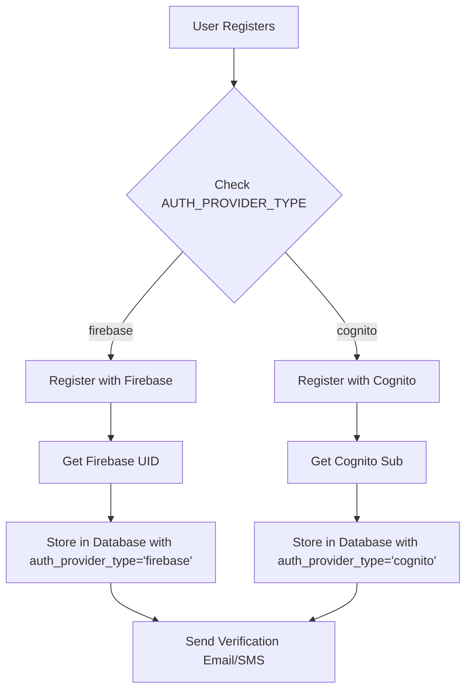
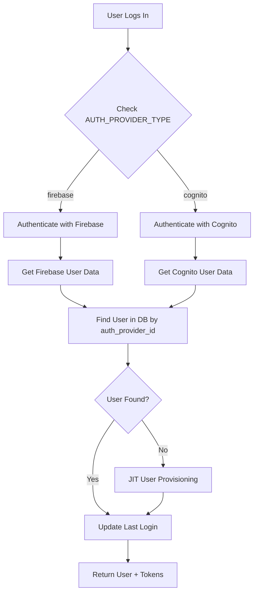

# Firebase/Cognito User Synchronization Strategy

## 🎯 Overview

This document explains how Ataraxia-Next handles user authentication and synchronization between Firebase and Cognito, ensuring a seamless user experience while maintaining data consistency.

## 🔧 Current Architecture: Single Provider Mode

### How It Works

**The system uses ONE auth provider at a time, not both simultaneously:**

1. **Configuration-Based Selection**: The `AUTH_PROVIDER_TYPE` environment variable (or database config) determines which provider is active
2. **Universal Database Schema**: The database captures users from ANY provider using the `auth_provider_type` field
3. **Provider-Specific Session Management**: Each provider manages its own sessions independently
4. **Seamless Switching**: Can switch providers without losing user data

### Configuration Priority

```bash
# Environment Variable (Highest Priority)
AUTH_PROVIDER_TYPE=cognito  # or 'firebase'

# Database Fallback
system_configs.config_key = 'auth_provider_type'
system_configs.config_value = 'cognito'

# Default Fallback
Default: 'cognito'
```

## 📊 Database Schema: Universal User Storage

### Users Table Structure

```sql
-- Universal user table that supports BOTH providers
CREATE TABLE users (
  id BIGSERIAL PRIMARY KEY,
  email VARCHAR(255) UNIQUE NOT NULL,
  
  -- Universal Auth Provider Fields
  auth_provider_id VARCHAR(255),      -- Firebase UID or Cognito Sub
  auth_provider_type VARCHAR(50),     -- 'firebase' or 'cognito'
  auth_provider_metadata JSONB,       -- Provider-specific data
  
  -- Standard User Fields
  first_name VARCHAR(100),
  last_name VARCHAR(100),
  role VARCHAR(50),
  account_status VARCHAR(50),
  is_verified BOOLEAN DEFAULT false,
  
  -- Verification Fields
  email_verified BOOLEAN DEFAULT false,
  phone_verified BOOLEAN DEFAULT false,
  
  -- Onboarding Fields
  onboarding_status VARCHAR(50),
  onboarding_step INTEGER DEFAULT 0,
  
  created_at TIMESTAMPTZ DEFAULT NOW(),
  updated_at TIMESTAMPTZ DEFAULT NOW()
);
```

### Example User Records

```sql
-- Firebase User
INSERT INTO users (email, auth_provider_id, auth_provider_type, first_name, last_name) 
VALUES ('user1@example.com', 'firebase_uid_123', 'firebase', 'John', 'Doe');

-- Cognito User  
INSERT INTO users (email, auth_provider_id, auth_provider_type, first_name, last_name)
VALUES ('user2@example.com', 'cognito_sub_456', 'cognito', 'Jane', 'Smith');
```

## 🔄 User Flow: Registration & Login

### Registration Flow



### Login Flow



## 🔐 Session Management Strategy

### Provider-Specific Sessions

**Firebase Sessions:**
- Managed by Firebase SDK
- ID Tokens with 1-hour expiry
- Refresh tokens handled client-side
- Custom claims for roles

**Cognito Sessions:**
- Managed by AWS Cognito
- Access tokens with configurable expiry
- Refresh tokens with 30-day expiry
- User attributes for metadata

### Database Session Tracking

```sql
-- Session tracking table
CREATE TABLE user_login_history (
  id BIGSERIAL PRIMARY KEY,
  user_id BIGINT REFERENCES users(id),
  login_at TIMESTAMPTZ DEFAULT NOW(),
  logout_at TIMESTAMPTZ,
  auth_provider VARCHAR(50),           -- 'firebase' or 'cognito'
  login_method VARCHAR(50),            -- 'email_password', 'google', etc.
  session_duration_minutes INTEGER,
  ip_address VARCHAR(45),
  user_agent TEXT
);
```

## 🚀 Implementation Details

### ConfigManager Integration

```typescript
// Auth provider initialization based on configuration
const config = await configManager.getAuthConfig();

if (config.authProviderType === 'firebase') {
  authProvider = new FirebaseProvider(
    config.firebaseProjectId,
    config.firebaseClientEmail,
    config.firebasePrivateKey
  );
} else {
  authProvider = new CognitoProvider(
    config.cognitoRegion,
    config.cognitoUserPoolId,
    config.cognitoClientId
  );
}
```

### Universal User Creation

```typescript
// Create user in database regardless of provider
const user = await prisma.users.create({
  data: {
    email,
    auth_provider_id: authProviderId,        // Firebase UID or Cognito Sub
    auth_provider_type: config.authProviderType, // 'firebase' or 'cognito'
    first_name: firstName,
    last_name: lastName,
    role,
    auth_provider_metadata: {
      registeredAt: new Date().toISOString(),
      provider: config.authProviderType,
      registrationMethod: 'email_password'
    }
  }
});
```

## 🔄 Provider Migration Strategy

### Switching Providers

When switching from Firebase to Cognito (or vice versa):

1. **Update Configuration**: Change `AUTH_PROVIDER_TYPE` environment variable
2. **Existing Users**: Remain in database with their original `auth_provider_type`
3. **New Users**: Created with the new provider type
4. **Gradual Migration**: Users can be migrated individually over time

### Migration Script Example

```typescript
// Migrate user from Firebase to Cognito
async function migrateUser(userId: string) {
  const user = await prisma.users.findUnique({ where: { id: userId } });
  
  if (user.auth_provider_type === 'firebase') {
    // Create user in Cognito
    const cognitoSub = await cognitoProvider.createUser(user.email, tempPassword);
    
    // Update database
    await prisma.users.update({
      where: { id: userId },
      data: {
        auth_provider_id: cognitoSub,
        auth_provider_type: 'cognito',
        auth_provider_metadata: {
          ...user.auth_provider_metadata,
          migratedAt: new Date().toISOString(),
          migratedFrom: 'firebase'
        }
      }
    });
  }
}
```

## 🎯 Benefits of This Approach

### 1. **No User Data Loss**
- All users stored in universal database
- Provider changes don't affect user data
- Historical login data preserved

### 2. **Seamless Provider Switching**
- Change environment variable to switch providers
- No code changes required
- Gradual migration possible

### 3. **Independent Session Management**
- Each provider handles its own sessions
- No complex synchronization required
- Provider-specific features available

### 4. **Healthcare Compliance**
- Audit trail for all authentication events
- User data sovereignty maintained
- HIPAA-compliant user management

## 🔍 Answering Your Questions

### Q: "when will the auth reach to cognito and firebase"

**A:** The auth reaches to **ONE provider at a time** based on configuration:
- If `AUTH_PROVIDER_TYPE=cognito` → All auth goes to Cognito
- If `AUTH_PROVIDER_TYPE=firebase` → All auth goes to Firebase
- The system doesn't use both simultaneously

### Q: "how are we ensuring cognito and firebase sync up the user"

**A:** **They don't sync with each other** - instead:
- The **database acts as the universal source of truth**
- Each provider manages its own users independently
- The database tracks which provider each user belongs to
- Users can be migrated between providers over time

### Q: "both will manage the user session separately"

**A:** **Correct!** Each provider manages sessions independently:
- **Firebase**: Uses Firebase Auth SDK, ID tokens, refresh tokens
- **Cognito**: Uses AWS Cognito, access tokens, refresh tokens
- **Database**: Tracks login history and session metadata for both

### Q: "our database is universal which capture both firebase and cognito user"

**A:** **Exactly!** The database schema supports both:
- `auth_provider_type` field identifies the provider ('firebase' or 'cognito')
- `auth_provider_id` stores the provider-specific user ID
- All other user data is provider-agnostic
- Same onboarding, verification, and business logic for both

## 🚀 Production Recommendations

### 1. **Start with One Provider**
- Choose Cognito for AWS-native deployments
- Choose Firebase for Google ecosystem integration
- Switch later if needed without data loss

### 2. **Monitor Both Scenarios**
- Track authentication success rates
- Monitor session duration and user experience
- Plan migration strategy if switching providers

### 3. **Maintain Provider Flexibility**
- Keep configuration-based switching
- Test both providers in staging
- Have migration scripts ready

This architecture ensures **maximum flexibility** while maintaining **data consistency** and **user experience**! 🎯