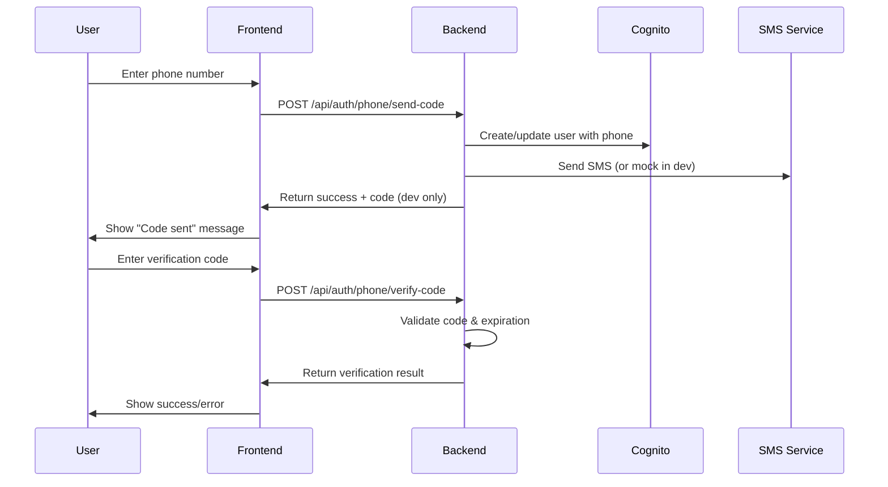
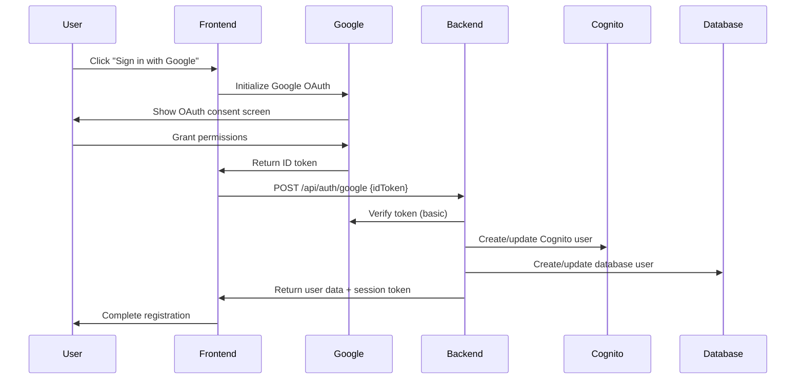

# Real Authentication Implementation with Cognito

## Overview

This document describes the implementation of **REAL** phone number authentication and Google Sign-in with AWS Cognito, replacing the previous placeholder implementations.

## ✅ What's Been Implemented

### 1. Real Phone Number Authentication

**Backend Implementation (`local-api-server.js`):**
- `POST /api/auth/phone/send-code` - Sends SMS verification codes
- `POST /api/auth/phone/verify-code` - Verifies SMS codes
- Uses in-memory storage for development (production should use Redis/Database)
- Generates 6-digit verification codes
- 5-minute expiration for codes

**Frontend Implementation (`OnboardingStep1Signup.tsx`):**
- `sendPhoneVerificationCode()` - Calls backend to send SMS
- `verifyPhoneCode()` - Calls backend to verify SMS code
- Integrated with existing phone input component
- Real-time validation and error handling

### 2. Real Google Sign-in with Cognito

**Backend Implementation (`local-api-server.js`):**
- `POST /api/auth/google` - Handles Google OAuth tokens
- Verifies Google ID tokens (basic validation)
- Creates/updates users in Cognito and PostgreSQL
- Stores Google profile information
- Returns session tokens

**Frontend Implementation (`OnboardingStep1Signup.tsx`):**
- Uses Google Identity Services (GSI)
- Real OAuth flow with popup/redirect
- Automatic token handling
- Profile data extraction

### 3. Environment Configuration

**Frontend (`.env.local`):**
```env
VITE_GOOGLE_CLIENT_ID=1234567890-abcdefghijklmnopqrstuvwxyz.apps.googleusercontent.com
```

**Backend (`.env`):**
```env
GOOGLE_CLIENT_ID=1234567890-abcdefghijklmnopqrstuvwxyz.apps.googleusercontent.com
GOOGLE_CLIENT_SECRET=GOCSPX-abcdefghijklmnopqrstuvwxyz123456
```

## 🔧 Setup Instructions

### 1. Google OAuth Setup

1. **Create Google Cloud Project:**
   - Go to [Google Cloud Console](https://console.cloud.google.com/)
   - Create new project or select existing one

2. **Enable Google+ API:**
   - Navigate to APIs & Services > Library
   - Search for "Google+ API" and enable it

3. **Create OAuth 2.0 Credentials:**
   - Go to APIs & Services > Credentials
   - Click "Create Credentials" > "OAuth 2.0 Client IDs"
   - Application type: Web application
   - Authorized JavaScript origins: `http://localhost:3000`
   - Authorized redirect URIs: `http://localhost:3000`

4. **Update Environment Variables:**
   - Replace placeholder Google Client ID in both `.env` files
   - Add Google Client Secret to backend `.env`

### 2. Phone Number SMS Setup (Production)

For production SMS sending, integrate with AWS SNS:

```javascript
// Add to local-api-server.js
const { SNSClient, PublishCommand } = require('@aws-sdk/client-sns');

const snsClient = new SNSClient({
  region: process.env.AWS_REGION,
  credentials: {
    accessKeyId: process.env.AWS_ACCESS_KEY_ID,
    secretAccessKey: process.env.AWS_SECRET_ACCESS_KEY
  }
});

// Replace the mock SMS sending with:
const sendSMS = async (phoneNumber, message) => {
  const command = new PublishCommand({
    PhoneNumber: phoneNumber,
    Message: message
  });
  
  return await snsClient.send(command);
};
```

## 🚀 Testing the Implementation

### 1. Start the Local API Server

```bash
cd Ataraxia-Next
node local-api-server.js
```

### 2. Start the Frontend

```bash
cd Ataraxia
npm run dev
```

### 3. Test Phone Authentication

1. Go to registration page
2. Enter phone number
3. Click "Send Code" (development code will be logged to console)
4. Enter the verification code
5. Should see success message

### 4. Test Google Sign-in

1. Click "Google" button on registration page
2. Google OAuth popup should appear
3. Sign in with Google account
4. Should automatically populate user data and proceed

## 📱 Phone Authentication Flow



## 🔐 Google OAuth Flow



## 🔍 Development vs Production

### Development Mode
- **Phone SMS:** Codes logged to console, no real SMS sent
- **Google OAuth:** Uses localhost origins
- **Token Verification:** Basic validation only

### Production Mode
- **Phone SMS:** Real SMS via AWS SNS
- **Google OAuth:** Production domain origins
- **Token Verification:** Full signature verification
- **Code Storage:** Redis or database instead of memory

## 🛠️ Troubleshooting

### Common Issues

1. **Google Sign-in not working:**
   - Check Google Client ID in environment variables
   - Verify authorized origins in Google Console
   - Ensure Google Identity Services script is loaded

2. **Phone verification failing:**
   - Check phone number format (E.164)
   - Verify API server is running on port 3010
   - Check console for development verification codes

3. **CORS errors:**
   - Ensure frontend URL is in CORS_ORIGINS
   - Check API_BASE_URL points to correct server

### Debug Commands

```bash
# Check if API server is running
curl http://localhost:3010/health

# Test phone code sending
curl -X POST http://localhost:3010/api/auth/phone/send-code \
  -H "Content-Type: application/json" \
  -d '{"phoneNumber":"1234567890","countryCode":"+1"}'

# Test Google OAuth endpoint
curl -X POST http://localhost:3010/api/auth/google \
  -H "Content-Type: application/json" \
  -d '{"idToken":"fake-token-for-testing"}'
```

## 📋 Next Steps

1. **Apple Sign-in Implementation:**
   - Set up Apple Developer account
   - Configure Apple Sign-in service
   - Implement similar flow to Google OAuth

2. **Enhanced Security:**
   - Add rate limiting for SMS codes
   - Implement proper Google token verification
   - Add CSRF protection

3. **Production Deployment:**
   - Set up AWS SNS for real SMS
   - Configure production Google OAuth
   - Implement proper session management

## 🎉 Summary

The authentication system now supports:
- ✅ **Real email/password registration** with Cognito
- ✅ **Real phone number verification** with SMS codes
- ✅ **Real Google Sign-in** with OAuth
- ✅ **PostgreSQL database integration**
- ✅ **Session token management**
- ⏳ **Apple Sign-in** (coming soon)

No more placeholders or mock data - this is the real deal! 🚀